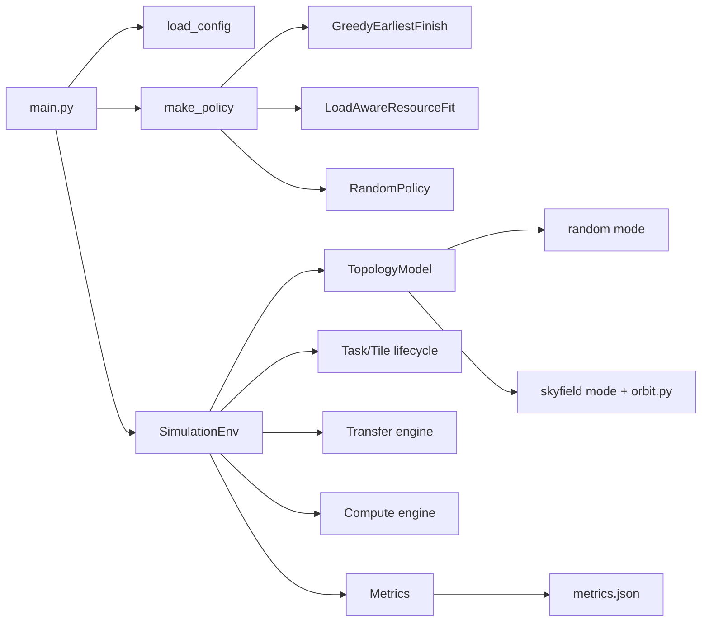
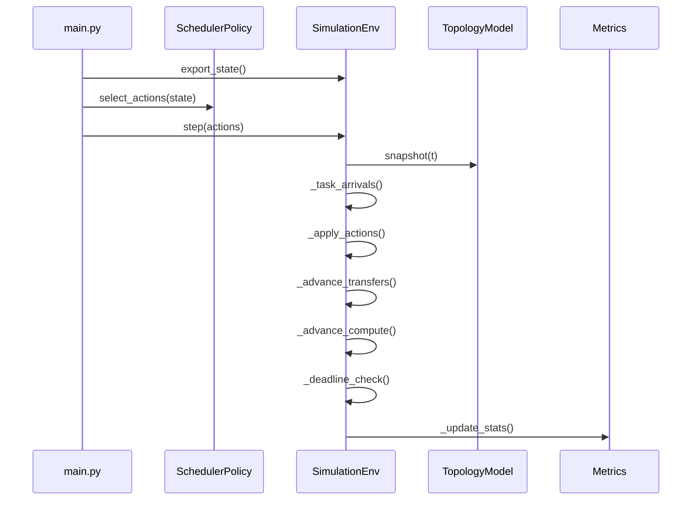

# 基于星间通信约束的分布式任务调度仿真器

一个离散时间（discrete-time）的多星任务调度仿真原型，聚焦遥感图像切块（tile/patch）后的卸载、传输和计算调度评估。

## 1. 项目在做什么

仿真每个时间步 `t=0..T-1` 的完整闭环：

1. 更新星间拓扑（随机或星历可见性）
2. 生成新任务（图像切分为多个 tile）
3. 调度器为每个 tile 选择 `LOCAL / OFFLOAD / WAIT`
4. 推进链路传输（按带宽离散推进）
5. 推进卫星计算（受队列、算力、显存约束）
6. 汇总指标与失败原因

输出结果写入 `metrics.json`，包含完成率、延迟、资源峰值、链路利用率和失败统计。

## 2. 架构图



## 3. 每步执行时序



## 4. 代码结构与职责

- `main.py`：程序入口，加载配置、选择调度策略、跑完整仿真并输出 JSON。
- `compare_baselines.py`：同一配置下对比 `greedy` 与 `load_aware`。
- `sim/env.py`：核心环境；维护任务/Tile状态机、传输队列、执行队列、失败处理和统计调用。
- `sim/entities.py`：核心数据结构（`Satellite/Task/Tile/Link/Transfer/Action/EnvState`）。
- `sim/topology.py`：拓扑生成器。支持：
  - `random`：链路 up/down 随机、带宽时变。
  - `skyfield`：基于星历位置估计可见性（地球遮挡 + 最小仰角 + 可选最大距离）。
- `sim/orbit.py`：Skyfield 轨道位置计算（TLE -> `EarthSatellite` -> 指定时刻位置）。
- `sim/scheduler/base.py`：调度器抽象接口 `SchedulerPolicy`。
- `sim/scheduler/greedy.py`：基于最早完成时间的贪心。
- `sim/scheduler/load_aware.py`：在贪心上加入资源余量惩罚（mem/vram/队列）。
- `sim/scheduler/random_stub.py`：随机策略和空策略（MARL/外部策略接入占位）。
- `sim/metrics.py`：指标累计与摘要生成。
- `examples/config.yaml`：默认示例配置。
- `data/tle/starlink_cluster_24.tle`：示例使用的 Starlink 星历子集（适合产生可见链路）。
- `czml_tools/tle_to_czml.py`：将 TLE 转为 CZML（用于 Cesium 可视化）。

## 5. 快速开始

## 5.1 安装依赖

```bash
pip install numpy pyyaml skyfield
```

> 如果只用 `topology.mode: random`，理论上不需要 `skyfield`。

## 5.2 运行单个策略

```bash
python main.py --config examples/config.yaml --policy greedy --output metrics.json
```

可选策略：`greedy` / `load_aware` / `random`

## 5.3 对比两个 baseline

```bash
python compare_baselines.py --config examples/config.yaml
```

## 6. 配置说明（核心字段）

### 全局仿真

- `seed`：随机种子（保证可复现）
- `num_sats`：卫星数量
- `sim_steps`：总步数
- `dt`：步长（秒）

### 任务与 Tile

- `task_arrival_rate`：泊松任务到达率（每步期望到达数）
- `image_size_mb`：单任务图像大小
- `num_tiles`：切块数
- `compute_cost_per_tile`：每个 tile 的计算成本
- `vram_base_gb` / `vram_alpha_per_mb`：显存需求模型
- `deadline_steps`：截止步数（`0` 表示不启用）

### 卫星资源

- `mem_capacity_gb`：存储容量
- `vram_capacity_gb`：显存容量
- `compute_rate`：计算速率
- `vram_policy`：`wait` 或 `reject`
- `transfer_fail_on_link_down`：传输遇断链时失败还是等待重连

### 拓扑（`topology`）

- 通用：`latency_ms`, `bandwidth_mbps_min/max`, `bandwidth_period`, `bandwidth_noise`
- `mode: random`：使用随机可见性模型（`link_up_prob`）
- `mode: skyfield`：
  - `start_time_utc`
  - `tle_file`: 外部 TLE 文件路径（推荐）
  - `tle_lines`: `[[line1, line2], ...]`（可选内联方式）
  - `earth_radius_km`
  - `min_elevation_deg`
  - `max_range_km`（`0` 表示不限制）
  - `bandwidth_distance_scale_km`（按距离衰减带宽，`0` 表示不衰减）

## 7. 调度策略简述

- `GreedyEarliestFinish`：估计本地和每个邻居的完成时间（队列等待 + 传输 + 计算），选最小可行项。
- `LoadAwareResourceFit`：在上述估计上引入资源惩罚项，规避显存/存储边界节点。
- `RandomPolicy/StubPolicy`：用于占位和未来 MARL 策略注入。

## 8. 指标输出格式

`metrics.json` 包含以下顶层字段：

- `overall`：tile/task 完成数与总数
- `latency`：tile/task 的 mean, p95, p99
- `resource`：平均队列长度、计算忙时、mem/vram 峰值
- `network`：链路利用率（实际发送 / 可发送）
- `failures`：失败原因计数（如 `mem_full`, `vram_oom`, `link_down`）

## 9. 当前边界与后续方向

- 当前路由是 1-hop（仅直连邻居）；尚未实现 multi-hop。
- 执行模型目前是每星单并发执行（`k=1`）。
- 结果回传与任务汇聚已简化处理（结果体积小）。
- 可继续扩展：多跳路由、断链重路由、优先级/抢占、能量模型、真实轨道数据导入流水线。
