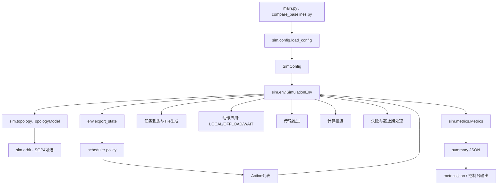

# 项目总览（bs）

## 1. 项目目标
该项目是一个“多卫星协同推理/任务卸载”离散时间仿真器。它通过可配置的任务到达、链路拓扑和资源约束，评估不同调度策略在以下维度的表现：

- 完成率（tile/task 完成数）
- 时延（tile/task 平均值与分位数）
- 资源占用（队列长度、计算忙时、内存/显存峰值）
- 网络利用率与失败原因分布

## 2. 目录与模块职责

### 顶层入口
- `main.py`
  - 单次仿真入口。
  - 负责：加载配置、构造环境与策略、执行 `sim_steps` 循环、输出指标 JSON。
- `compare_baselines.py`
  - 基线对比入口。
  - 负责：在同一配置下分别运行 `greedy` 与 `load_aware`，输出简要对比摘要。
- `examples/config.yaml`
  - 示例配置文件。
  - 负责：定义仿真规模、任务模型、资源参数、拓扑参数。
- `metrics.json`
  - 示例输出文件（由 `main.py --output` 产出）。

### 核心仿真包 `sim/`
- `sim/config.py`
  - 定义 `SimConfig` 配置数据结构。
  - 支持从 YAML/JSON 加载并提供默认值。
- `sim/entities.py`
  - 定义领域对象与枚举：
    - 状态与动作：`TileState`、`ActionType`
    - 失败原因：`FailureReason`
    - 数据对象：`Task`、`Tile`、`Satellite`、`Transfer`、`Link`、`EnvState`
- `sim/env.py`
  - 仿真环境核心（`SimulationEnv`）。
  - 每个 step 顺序：
    1. 任务到达（泊松）
    2. 应用策略动作（本地/卸载/等待）
    3. 推进传输
    4. 推进计算
    5. 截止期检查
    6. 指标统计
  - 管理 tile 生命周期、资源占用、失败处理。
- `sim/metrics.py`
  - 指标采集与汇总。
  - 输出结构分为 `overall / latency / resource / network / failures`。
- `sim/topology.py`
  - 链路拓扑模型。
  - 支持两种模式：
    - 随机模式：链路 up/down 由概率控制，带宽按周期波动+噪声。
    - `sgp4` 模式：由 TLE 与轨道位置计算可见性，再叠加带宽模型。
- `sim/orbit.py`
  - SGP4 轨道计算封装。
  - 负责解析起始时间、加载 TLE、输出时刻卫星位置。

### 调度策略 `sim/scheduler/`
- `base.py`
  - 策略抽象基类 `SchedulerPolicy`。
- `greedy.py` (`GreedyEarliestFinish`)
  - 以“预计完成时间最短”为目标，在本地执行和邻居卸载间做贪心选择。
- `load_aware.py` (`LoadAwareResourceFit`)
  - 在预计完成时间基础上加入资源适配（内存/显存余量）惩罚。
- `random_stub.py`
  - `RandomPolicy`：随机选择本地/等待/卸载，用于对照。
  - `StubPolicy`：返回空动作。

## 3. 运行流程（端到端）
1. CLI 读取配置路径与策略名。
2. `load_config` 生成 `SimConfig`。
3. `SimulationEnv(cfg)` 初始化：卫星资源、拓扑、随机种子、指标容器。
4. 每个仿真步：
   - `env.export_state()` 导出状态视图给策略。
   - 策略返回 `Action[]`。
   - `env.step(actions)` 推进系统状态与指标。
5. 结束后 `metrics.summary()` 输出聚合结果。

## 4. 状态与资源机制
- Tile 状态流转：
  - `CREATED -> QUEUED -> (TRANSFERRING) -> READY -> RUNNING -> DONE`
  - 异常时进入 `FAILED`（如 `mem_full / vram_oom / link_down / deadline_miss / no_route`）。
- 资源约束：
  - 存储内存：入队和卸载目标预留内存，完成/失败时释放。
  - 显存：启动计算时检查，`vram_policy` 决定等待或拒绝。
- 网络约束：
  - 链路可用性、带宽决定传输推进速度；可配置链路中断是否直接判失败。

## 5. 指标说明
- 完成度：`completed_tiles/total_tiles`, `completed_tasks/total_tasks`
- 时延：tile/task 的 mean、p95、p99
- 资源：平均队列长度、计算忙时、内存与显存峰值
- 网络：链路利用率（used/available）
- 失败：按原因计数

## 6. 扩展建议
- 新策略：在 `sim/scheduler/` 新增类并实现 `select_actions`，再在 `main.py::make_policy` 注册。
- 新拓扑：在 `TopologyModel` 中新增 `mode` 分支。
- 新指标：在 `Metrics` 中新增采集字段与 `summary()` 输出。
- 新任务模型：修改 `SimulationEnv._task_arrivals` 的到达分布或任务参数生成。

## 7. 快速使用
```bash
python main.py --config examples/config.yaml --policy greedy --output metrics.json
python compare_baselines.py --config examples/config.yaml
```

## 8. 架构图


